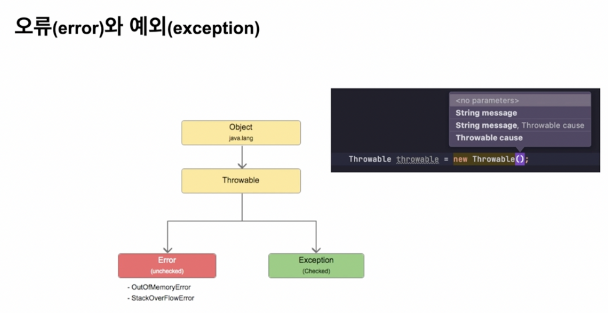
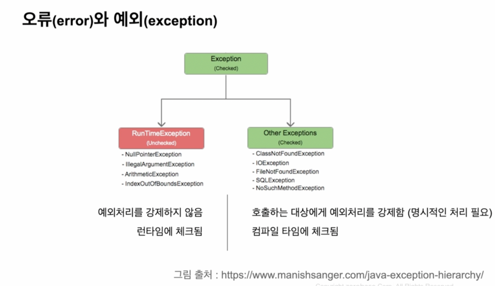

### error
- Compile Error
  - 컴파일 타임에 발생하는 에러
  - syntax
  - type

- Runtime Error(실행하기 전엔 알 수 없다)
  - 프로그램 실행 중 발생하는 에러

### error, exception

- Throwable
- exception 
  - 우리가 작성한 코드 내에서 발생함
  - 예외 발생 시, 처리 할 수 있는 핸들링기법에 대해 알아야 함

