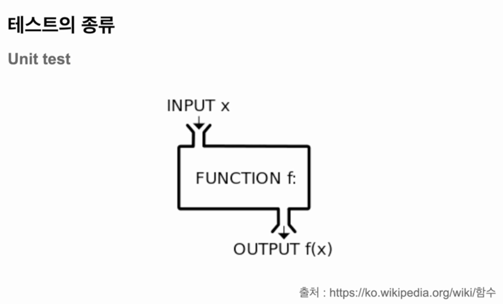
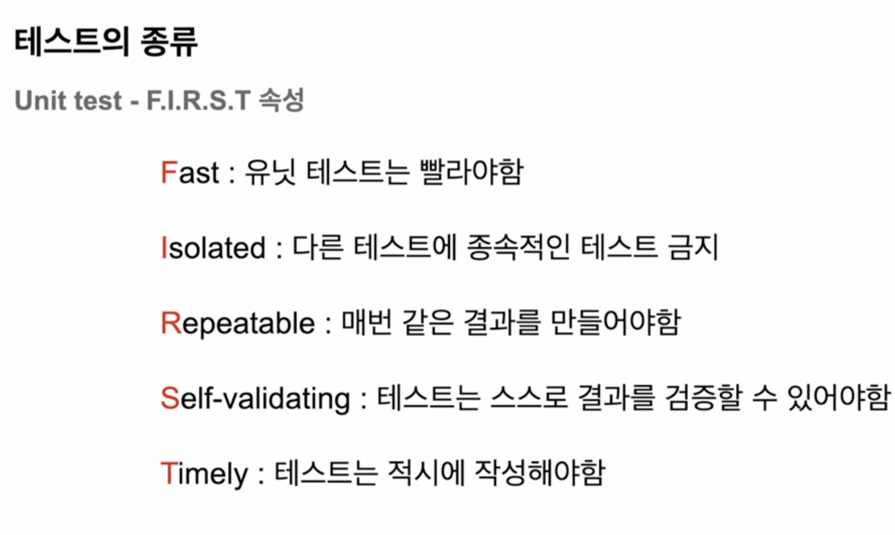
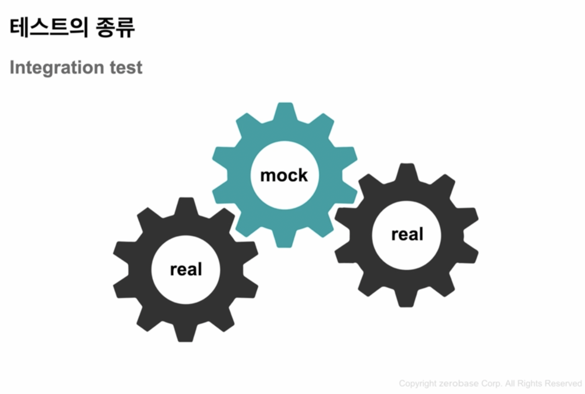

### 당신의 Application은 어떻게 테스트 하고 있는가?
- Human-Driven Test
  - 서버를 실행한다 > API요청값을 만든다 > API를 요청한다 > 결과값을 확인한다 > 결과값의 상세 필드들이 올바른지 확인한다.
- 시간이 많이 소요된다.

### 테스트코드를 작성해야 하는 이유
(로컬 서버를 띄우는 시간이 오래 걸린다 가정했을 때)
- 여러 로컬 서버 환경상의 이유로 시간이 많이 걸린다 -> 테스트코트 작성으로 시간을 단축 시킬 수 있다.
  - 노가다 테스트 해방
- 테스트 코드를 통한 빠른 피드백, 검증
- 안정성 확보 -> 안전한 리팩토링
- 장기적으로 더 나은 생산성 확보

### 테스트의 종류
#### Unit test

  - 일반적으로 Unit Test의 범위 -> 함수 한 개 정도의 범위 (일반적으로)
    - 함수에서 DB호출 or N/W호출 -> Boot Container를 띄워야 한다. -> 테스트 끼리의 종속성을 만들어 내기도 한다. -> UnitTest의 FIRST속성을 위배
  - 가장 작은 단위의 테스트 : 소프트웨어가 예상한대로 정확하게 동작하는지 테스트 
  - 매번 똑같은 결과를 반환
  - 만일 함수가 거대해서 테스트하기 힘들다 ? 함수에서 여러가지 일을 한다 -> 관심사의 분리작업 필요 -> 함수는 하나의 일만 처리해야한다.
  
#### Integration test

- 여러 모듈이나 DB등 의 통합적인 테스트 -> 환경에 대한 테스트
  - 일반적으로 Spring BootTest

#### E2E test 
- 시스템 전체 실제 유저입장에서의 검증