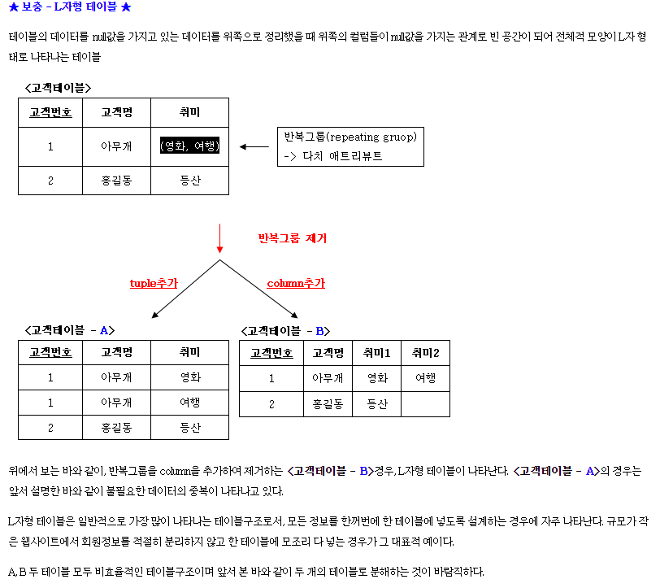

- [신입 개발자 역량 평가](https://github.com/EBvi/dev-matrix/blob/master/%E1%84%89%E1%85%B5%E1%86%AB%E1%84%8B%E1%85%B5%E1%86%B8%20%E1%84%80%E1%85%A2%E1%84%87%E1%85%A1%E1%86%AF%E1%84%8C%E1%85%A1%20%E1%84%8B%E1%85%A7%E1%86%A8%E1%84%85%E1%85%A3%E1%86%BC%20%E1%84%91%E1%85%A7%E1%86%BC%E1%84%80%E1%85%A1.md)
- [경력 개발자 역량 평가](https://github.com/EBvi/dev-matrix/blob/master/%E1%84%80%E1%85%A7%E1%86%BC%E1%84%85%E1%85%A7%E1%86%A8%20%E1%84%80%E1%85%A2%E1%84%87%E1%85%A1%E1%86%AF%E1%84%8C%E1%85%A1%20%E1%84%8B%E1%85%A7%E1%86%A8%E1%84%85%E1%85%A3%E1%86%BC%20%E1%84%91%E1%85%A7%E1%86%BC%E1%84%80%E1%85%A1.md)

`2022. 1. 3.`
### 1. 모델링
- 논리적 모델과 물리적 모델이 무엇을 말하는지 모른다
- 논리적 모델과 물리적 모델을 구분하여 모델링할 수 있다
- L자형 테이블이 왜 위험한지 알고 있다 (필드가 많이 늘어나는 것이 어떤 영향을 미치는지 이해한다)
- 정규화를 알고 이를 적용하여 모델링을 할 수 있다

### 1.1 모델링?
- Model : 모형, 축소형 의미
    - 사람이 살아가면서 나타날 수 있는 다양한 현상에 대해 일정한 표기법으로 표현 한 모형
    - 목적달성을위한 커뮤니케이션 효율성 극대화

#### 1.2 모델링의 단계 
- 현실에서의 개체 → 개념적 모델링 → 논리적 모델링 → 물리적 모델링
- 논리적 모델링 : 업무의 요건을 완전하고 명확하게 표현한 모델
- 물리적 모델링 : 요구사항을 특정 DBMS의 특징을 최대한 활용하여 효율적인 Data Access과 성능을 고려하여 완벽하게 표현

#### L자형 테이블
- 반복 그룹을 Column을 추가하여 제거하는 경우
  - 문제점 : 공간이 낭비된다.

   

[데이터 모델링 관련 - 최고의 블로그 포스팅](https://m.blog.naver.com/PostView.naver?isHttpsRedirect=true&blogId=thwlstmxk&logNo=221059148441)

