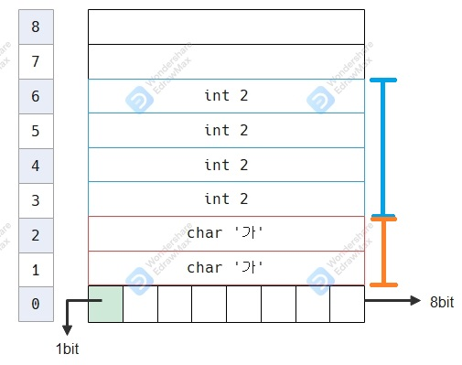
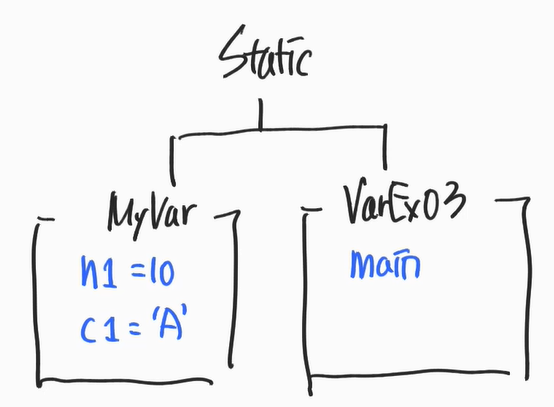

### 1. JDK란?

- RAM : 전류이용 데이터 저장 → 휘발성 메모리
- HDD : 물리적 기록 → No 전류이용 → 비휘발성 메모리
- 사용자가 직접 하드웨어를 통한 하드웨어(RAM, HDD 등) 조작이 어려움
- *사용자는 "운영체제"가 필요함*
    - ex) win/mac/linux...


- OS사용자의 명령을 받아 하드웨어(HDD) 직접제어.


- 개발자는 JDK를 활용해 OS와 소통하고 HDD를 제어한다.

### 2. 왜 OS마다 다른 JDK를 받을까?
- OS마다 이해할 수 있는 기본 명령어가 다르다.

### 3. JDK 환경변수 설정

- java작성 파일은 어디서 작성을 해도 된다.
- java작성 파일은 어느 OS에서도 실행이 가능하다.
  - 각 OS에 맞는 JVM에 전달이 된다.
  

### 4. Static, Heap, Stack
#### 4.1.1 memory ?
- memory 영역이란 ?
  - 저장영역 → 서랍연상
  - 주소가 있고, 데이터가 있다.
- 연산과정 → CPU가 주체가 되어 메모리 주소에 해당하는 data연산 후 메모리 부여 
- 출력과정 → 부여된 메모리 주소로 출력 하드웨어로 전송

#### 4.1. 논리적으로 구분된 메모리
- 물리적X, 논리적으로 Static, Heap, Stack 영역을 나누어 메모리 할당
#### 4.2. why ?
- 자원은 유한하지만
  - 프로그램 시작부터 종료까지 필요한 메모리가 있다.
  - 잠시 필요한 메모리가 있다.
  - 더 잠시 필요한 메모리가 있다.
- 위 세 가지 영역을 나눠서 사용해야한다.
- 각 영역을 제어할 수 있는 문법들이 명확하다. 
### 4.3. 각 영역 (나중에 더 알아보기)
- static : 프로그램의 시작 전 ~ 끝 
  - 부하가 제일 크다.
- heap : 프로그래밍 진행 중 원할 때 할당 
  - 동적할당 영역 
  - static영역보다 생명주기가 짧다.
- stack : 행위에 대한 정보 
  - 생명주기가 가장 짧다.

### 5. 자료형
- 한정된 공간에 메모리 룰 없이 '적재'하면 
  1) 낭비가 심하다.
  2) 꺼내는데 비용이 많이 든다.
  
- 어떻게 해야하나?
  1) 래핑을 해야 한다.
  2) 크기를 알아야 한다.
  
#### 5.1. 자료형의 종류(Simple) - 8가지자료형 中 4가지
- [boolean] type
  - 1bit : 0 or 1 * 1bit(상자) : 2^1 = 2
- [int] type
  - 32bit : 0 or 1 * 32bit(상자) : 2^32 = 42억9천...
- [double] type
  - 64bit
- [char] type
  - 16bit
- 등등

### 6. 자료형 메모리 구조

- RAM(메모리) 논리적 구조
  - 컴퓨터의 가장 작은 단위 : bit
  - 1bit * 8 = 8bit
  
#### 6.1. why?
- 왜 8bit인가?
  - 8bit = 2^8 = 256 (알파벳 한 문자 표기)
  
#### 6.2. 8bit means
- 8bit는 *1Byte*를 의미한다. (대문자 표기 주의)

#### 6.3. example
````java
class A {
    int a = 2; //값을 초기화 한다 = 메모리 공간에 할당한다
    char b = '가';
}
````


- 변수 a는 3에서 6까지의 주소를 가진 & 4Byte 크기를 가진 주소이다.
- 해당 값은 2이다.

### 7. 자바 코드 실행 원리
1. 자바의 모든 코드는 클래스 나부에 존재해야 한다.
2. 실행 전, static키워드를 static메모리 영역에 로드한다.
    - main method는 {}내부가 올라가는 것이 아닌 main이라는 이름만 올라간다.
3. 자바를 실행하면 main이라는 메소드 내부를 실행한다. 
4. main이 실행 될 때는 main이라는 stack공간이 열린다.
5. 메소드 내부가 끝나면 종료된다.
````java
public class Sample {
    
    static int n2 = 20;
    
    public static void main(String[] args) {
        int n1 = 10;
        System.out.println(n1); // → main이라는 stack 공간
        System.out.println(n2); // → Sample이라는 static 공간
        //n1과 n2를 불러오는 메모리 공간이 다르다.
  }
}
````

- a.java → compile → a.class → 로드 → JVM → 실행 → a.class 내부 static 키워드 체크 → static 메모리 영역 할당

### 8. 클래스 자료형(Beans)
- int와 char를 한번에 저장할 수 있는 타입이 있나? Type = (20,'A') → 없다.
- 개발자가 정의할 수 있다 : 여러가지 data를 갖고있는 클래스
  - 클래스 자료형
  - 커스텀 자료형
  - 정식명칭 Beans
  
- static memory area 내부에서 클래스별로 구분이 된다. <br/>
  
- 클래스 이름으로 인덱싱하여 data를 찾는다 MyVar.n1 ('.'은 연결 연산자)

### 9. 클래스 자료형(Heap에 동적으로 저장이 되는)
#### 9.1. class 내부의 값을 static으로 저장할때의 단점
1. 프로그램 시작 전 ~ 프로그램 종료까지 메모리에서 사라지지 않는다.
2. 원하는 갯수만큼 미리(여러가지) 만들어 두어야 한다.
    - 필요할 때마다 클래스 자료형을 만든다 → *불가능*
    - n개의 A클래스를 만들고 프로그램 실행 → n+1번째 A클래스를 만들 수 없다.
 
  * why ? <b>static의 실행주기 = 시작 전 ~ 끝</b>
  * 다른방법 : 충분히 만들어놓는다. → 비효율적

` static은 정적이다. `
- 프로그램이 시작 된 후에 관리할 방법이 없다. 

` 동적인 방법을 찾아야 한다. `
- heap 공간 이용 → *동적 저장 공간* → new A();

 ` heap 공간에 A클래스가 static을 제외한 모든 data를 할당해 `
 
````java
class Sample { 
    public static void main(String[] args) { //→ main의 stack area 가 열린다.
        new A(); //heap공간 → 공간을 찾을 수 있는 방법이 없다. 
        int a = 25; // main → stack area
        //a를 찾는건 쉽지만, heap공간에 new A(); 를 찾을 수 없다. → 정의해야한다.
        A aLoc = new A();
        //직접 만든 A타입의 aLoc변수
    } //→ main의 stack area가 닫힌다.
}
````