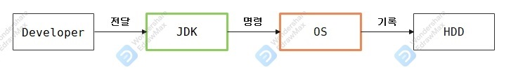
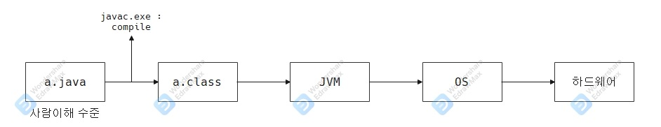

### 1. JDK란?

- RAM : 전류이용 데이터 저장 → 휘발성 메모리
- HDD : 물리적 기록 → No 전류이용 → 비휘발성 메모리
- 사용자가 직접 하드웨어를 통한 하드웨어(RAM, HDD 등) 조작이 어려움
- *사용자는 "운영체제"가 필요함*
    - ex) win/mac/linux...

- OS사용자의 명령을 받아 하드웨어(HDD) 직접제어.

- 개발자는 JDK를 활용해 OS와 소통하고 HDD를 제어한다.

### 2. 왜 OS마다 다른 JDK를 받을까?
- OS마다 이해할 수 있는 기본 명령어가 다르다.

### 3. JDK 환경변수 설정

- java작성 파일은 어디서 작성을 해도 된다.
- java작성 파일은 어느 OS에서도 실행이 가능하다.
  - 각 OS에 맞는 JVM에 전달이 된다.
  

### 4. Static, Heap, Stack
#### 4.1.1 memory ?
- memory 영역이란 ?
  - 저장영역 → 서랍연상
  - 주소가 있고, 데이터가 있다.
- 연산과정 → CPU가 주체가 되어 메모리 주소에 해당하는 data연산 후 메모리 부여 
- 출력과정 → 부여된 메모리 주소로 출력 하드웨어로 전송

#### 4.1. 논리적으로 구분된 메모리
- 물리적X, 논리적으로 Static, Heap, Stack 영역을 나누어 메모리 할당
#### 4.2. why ?
- 자원은 유한하지만
  - 프로그램 시작부터 종료까지 필요한 메모리가 있다.
  - 잠시 필요한 메모리가 있다.
  - 더 잠시 필요한 메모리가 있다.
- 위 세 가지 영역을 나눠서 사용해야한다.
- 각 영역을 제어할 수 있는 문법들이 명확하다. 

### 5. 자료형
- 한정된 공간에 메모리 룰 없이 '적재'하면 
  1) 낭비가 심하다.
  2) 꺼내는데 비용이 많이 든다.
  
- 어떻게 해야하나?
  1) 래핑을 해야 한다.
  2) 크기를 알아야 한다.
  
#### 5.1. 자료형의 종류(Simple) - 8가지
- boolean
- int
- double
- char
- 채워야함
