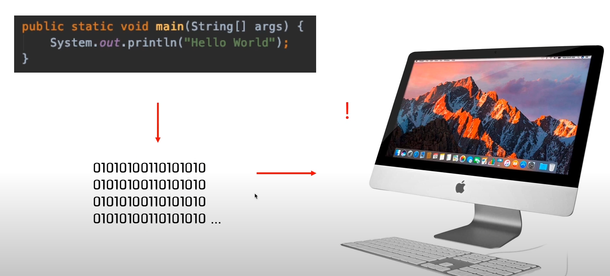

### JAVA를 공부하기 전에 알아두면 좋은 것들_1
#### JAVA라는 언어를 컴퓨터가 '어떻게' 알아 듣는지?

- 컴퓨터는 0과 1로만 동작한다.
> System.out.println("Hello World"); 
로는 해석이 불가능하다.

- 위 코드가 0,1로 컴파일한다.
- 사람언어 → 컴파일 → 바이트 코드(바이너리 코드)
- 컴파일 하는 주체 → 컴파일러

#### 바이트 코드의 조합은 운영체제마다 다르다.
- 각 운영체제에 맞는 JVM
- 자바는 C와다르게 컴파일러가 하나만 있으면 된다 → 그 바이트 코드로 → 각 운영체제에 맞는 JVM이 알아서 번역한다.
- 자바는 컴파일러가 하나 → 컴파일 된 결과물이 모두 동일한 상태 → 각각 JVM에 맞는 운영체제에게 한 번 더 번역
- 장점
    - 한 번 작성하고, 어디서든 동작이 가능하다.
    
#### JDK, JRE, JVM
- JDK > JRE > JVM의 포함관계
- JVM 
    - OS별로 존재
    - 바이너리 코드를 읽고 검증하고 실행
- JRE
    - Java Runtime Environment
    - JRE = JVM + 자바 프로그램 실행에 필요한 라이브러리(System, Scanner 등) 파일 등
    - JVM의 실행환경을 구현
- JDK
    - JDK = JRE + 개발을 위한 도구
    - 컴파일러, 디버거 등

- JRE는 실행에 필요한 환경, JDK는 개발에 필요한 환경
- JAVA의 버전 = JDK의 버전

#### JDK 버전과 종류
- Oracle JDK : 오라클 JDK, 개인에게 무료, 기업용은 유료
- Open JDK : 오라클 JDK와 비슷한 성능, 언제나 무료

