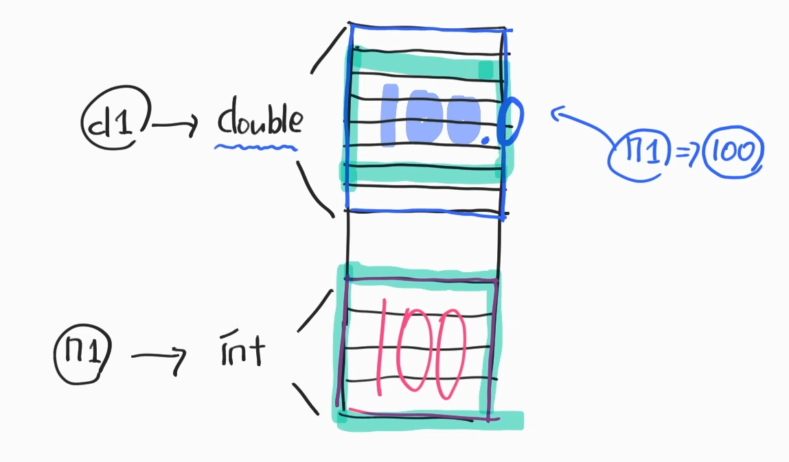

### 1. Operator
- 대입 연산자
  - int num = 10; → 프로그래밍에선 오른쪽부터 읽고 왼쪽으로 대입한다
- 사칙 연산자
  - '+', '-', '/', '*' ㅁ
  - '+' 연산자는 String + String도 가능
  - 숫자끼리의 연산 : 수치연산
  - String 연산 : 결합연산  
- 비교 연산자
  - return → true or false
  - == !=
- 논리 연산자
  - AND : &&
  - OR : ||
- 조건 연산자
  - 삼항연산자
````java
public class OperEx05 { 
    public static void main(String[] args){
      int n1 = 5;
      System.out.println(n1 == 5 ? "5가 맞다":"5가 아니다");
        
      int point = 59;
      System.out.println(point >= 60 ? "통과":"재수강");
    }
  }
````  
  
### 2. 나누기 관련 연산
- 130 / 100  : 몫
- 130 % 100 : 나머지

### 3. 캐스팅(형변환)
````java
public class CastEx01 { 
    public static void main(String[] args) {
        int n1 = 100; //4Byte
        double d1 = n1; //8Byte (8Byte → 4Byte) → 업캐스팅(묵시적)
      
        double d2 = 100.8;
        int n2 = (int)d2; // 다운캐스팅(명시적 형변환) : data유실될 수 잇다. 
        //Byte가 큰 data → Byte가 작은 data
    }
}
````
</br> 

#### 3.1. 연산
- int와 double의 연산 double의 Byte를 따른다.
