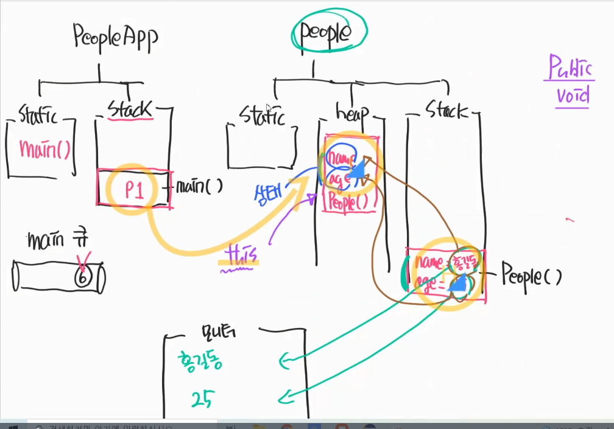

주요개념 한 가지
===
> 추상적인 것들과 구체적인 것들의 구분과 구현


### 1.객체지향 프로그래밍 문법
#### 1.1. import 개념
- a.package → A.java
- b.package → B.java
> 다른 패키지에 있는 클래스를 사용하고자 할 때 import키워드를 사용해야 한다.

#### 1.2. 접근제어자
- default → 동일한 패키지에서만 접근 가능
- public → 다른 패키지에서도 접근 가능 → 모든 곳에서 접근 가능
- private → 동일한 클래스에서만 접근 가능

#### 1.3. 라이브러리 만들기
- 패키지는 .java파일의 모임
- jar package의 모임
- import != Build Path
  - import : 내 프로젝트 내부에 존재한다.
  - build path : 다른 프로젝트에서 가지고 온다.
    - "외부 jar파일을 내 프로젝트로 build path 해야한다"
- jdk설치 - jdk, jre, jvm 
  - jre : 쉽게 사용 하라고 제공해주는 lib
  
#### 1.4. Class 만들기
##### 1.4.1. final
- 커스텀 자료형 : 다양한 data를 가질 수 있다.
  - int → 한 가지의 상태만 가질 수 있다.
  - String → 한 가지의 상태만 가질 수 있다.
- 여러가지 특징(상태)를 가지고 있다.

````java
public class Dog { 
    int age = 20; //→ 변경이 가능하다
    String name = "토토"; //→ 변경이 가능하다
    final String type = "말티즈"; //→ 변경이 '불'가능하다 → 상수 
}
````

##### 1.4.2. constructor
- null도 데이터 중 하나
  - means : 값이 없음을 의미
- ***상태를 초기화 하지 않는 이유***
  - new연산자를 사용 할 때마다, 다른 상태를 가진 객체를 생성하기 위해서
   
- Default constructor
  - 별도 생성자를 구현하면, 기본 생성자를 구현할 수 없다.

````java
public class Dog { 
    int age = 20;               //heap 공간
    String name = "토토";         //heap 공간
  
    public Dog() { //default 생성자
        //개발자가 다른 생성자를 구현하면 자동으로 사라지는 생성자.
    }
    public Dog(int age, String name) { //stack공간
        this.age = age;         //stack 공간 → heap 공간으로
        this.name = name;       //stack 공간 → heap 공간으로
        //age와 name은 지역변수 → Dog()라는 생성자(메서드)가 가진 지역변수
    }
}
````
- Dog → Dog라는 타입
- dog → heap 공간을 가리키는 주소
- new → 메모리에 할당(heap) → age, name
- Dog() → 생성자를 호출 → 상태를 초기화 하기 위해서


##### 1.4.3. this keyword
- this : 자기자신의 heap 공간을 가리킨다.
  - stack 공간 → heap 공간으로
  
</br>   