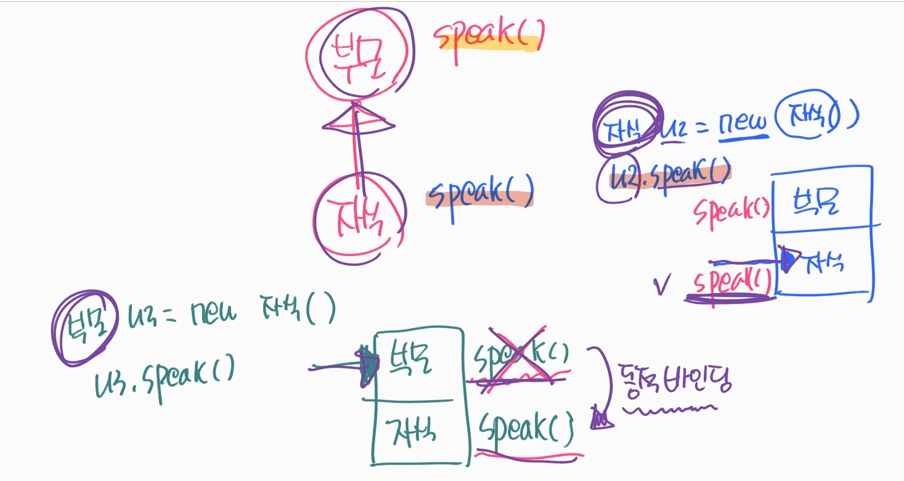
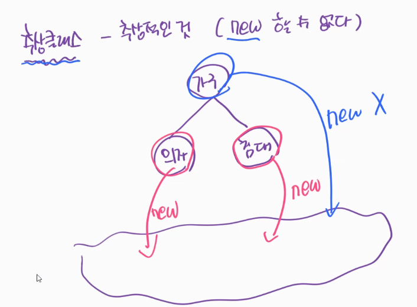
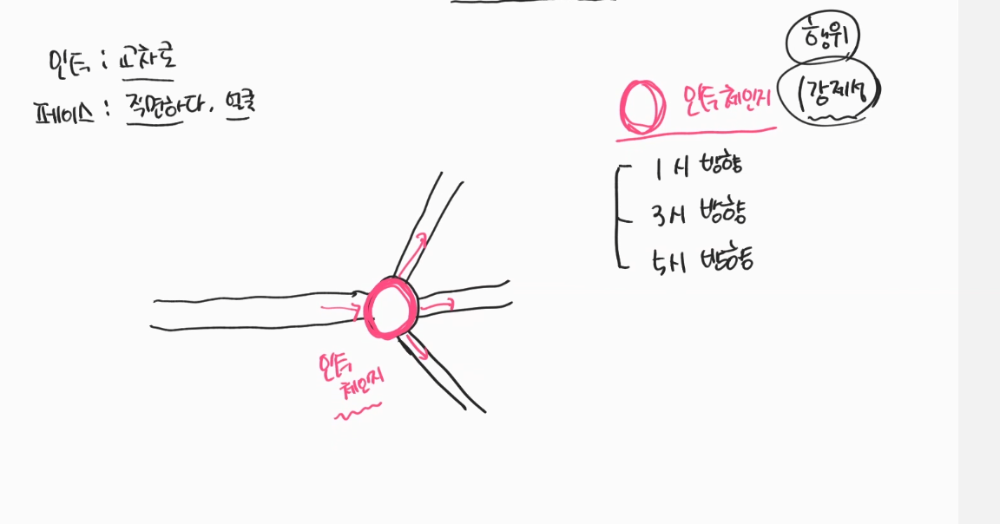
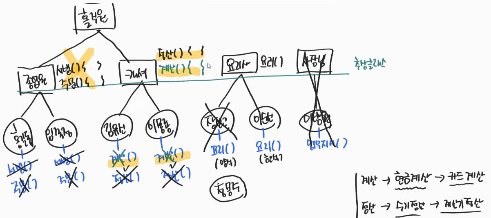
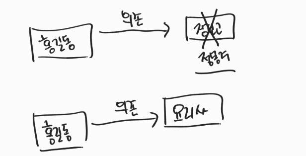

### 1.객체지향 프로그래밍 이해
#### 1.1. instance란?
- 클래스 : .java로 정의된 ***설계도***
- 인스턴스 : heap공간에 있는 클래스 ? → ***new 가 된 것***
- 오브젝트 : 인스턴스가 될 수 있는것 → ***new 가 가능한것들***
    - 구체적인 것 (셀 수 있는) 
    - 추상적인 것 (셀 수 없는)
  
#### 1.2. 클래스의 상태와 행위
- 클래스 구성
  - 필드 : 상태
  - 메서드 : 행위
  
- Object-Oriented Programming
  > 1) 상태는 스스로 변하는게 아니라, 행위에 의해 변한다.
  >    - 클래스의 필드는 메서드에 의해서 변한다.
  >    - 직접 상태를 변화 하는 것 : 현실에서의 말도 안되는일 → 근거가 없는 변화
  >    - ***상태에 접근제어(private)*** + ***행위를 통한 상태 변화*** → ***근거가 명확한 변화***
  > 

### 2. 상속
#### 2.1. 상속 → Extend : 확장하다.
- 상속은 추상화를 해준다.
- 상태, 행위 물려받는다.
  - import 개념 : 상태, 행위를 가져와서 사용할 수 있다. → 상속과는 다른 개념
  
> * 엔진( 타입일치 X ) → 자동차  
> * 햄버거( 타입일치 O )( 추상화 된 존재 ) ← 치즈버거, 치킨버거

- 상속과 콤포지션 예재 : [코드보기](https://github.com/GyeomFka/java-dare/blob/master/src/main/java/ch05/OOPEx02.java)

#### 2.2. 상속활용
- 상속을 잘 활용하는 것이란?
  - 재사용의 관점에서 상속 == 콤포지션 
  - 같은 구현이 가능하지만 상속은 어떻게 쓰는게 가장 효율적인가 ?
  
##### 2.2.1. 다형성
- B extends A (B가 A를 상속할 때)
   
  
- Heap공간에 B를 호출하면 (new B();) → B, A가 함께 뜬다. 
- Heap공간에 A를 호출하면 (new A();) → A만 뜬다.
- 상속관계에서의 호출은 A or B = new B(); 이지만 
  - A로 호출 → A를 바라본다.
  - B로 호출 → B를 바라본다.

[코드보기](https://github.com/GyeomFka/java-dare/blob/master/src/main/java/ch05/OOPEx03.java)
  

##### 2.2.2. Overloading (과적재) 이란?
- Method이름이 같아도 다른 Method로 인식한다 → 매개변수의 ***타입***, ***갯수***의 따라서

#### 2.2.3. 왜 사용하는가 ?
- 활용해야 하는 Method이름이 통일된다. → 매개변수를 다르게 하면 다른 Method호출

#### 2.2.4. 한계점, 단점
- 경우의 수에 따라 Method가 계속 늘어난다.

> 경우의 수가 제한이 있다면, 효율이 나오지만  
> 경우의 수 제한이 없다면, 비효율적이다

#### 2.2.5 overloading의 한계점 극복 → overriding
- override : 부모의 메서드를 무효화 하다
  - 부모가 갖고있는 메소드를 동일하게 자식이 갖게 되면 자식타입으로 실행이 된다.
  
- (B가 A를 상속받고) 상속에서 A a = new B();
  - A와 B가 같은 메서드를 같고 있을때
  - B의 메소드를 실행한다
  - A의 메소드를 실행시킴에도 B의 메소드가 호출 되는것 → ***동적바인딩***
    
 

#### 2.3. 추상 클래스
 
- new 연산자 사용 할 수가 없다 → 메모리에 띄울수가 없다.
- 가구는 의자와 침대의 추상화 된 개념이므로 가구를 메모리에 new 할 수 없다. 
> 단순 클래스 상속 : 구현부 에서의 메서드 호출을 위해서 해당 함수가 껍데기 메서드로만 존재하기 때문에 
> 추상클래스로 사용을 하는게 효율적이다. 
> 추상클래스에 추상 메서드 생성이 가능하다. → 강제성 부여 

- 추상메서드 : 몸체{} 가 있으면 ***안된다.***
  - 강제성 부여하기 위해
- 몸체{} 가 있는 메소드 생성도 가능하긴 하다.

[코드보기](https://github.com/GyeomFka/java-dare/blob/master/src/main/java/ch05/OOPEx07.java)

/*
'21.11.25.(목). 여기서부터 다시 정리
*/

##### 2.3.1 추상클래스 = 미완성 설계도
- 타입을 일치시키면서, 완성되지 않은 공통부분을 만든다.

[코드보기](https://github.com/GyeomFka/java-dare/blob/master/src/main/java/ch05/OOPEx09.java)

### 3. Interface
- 행위에 대한 강제성 개념
  
 

- '약속'도 비슷한 개념인데, 일방적인 '약속' (갑-을 관계의 약속)
  - 경우의 수를 한정 해 둔다
- 프로토콜과는 다르다
  - A - B - C 와 동등한 관계의 약속
  
#### 3.1. interface in java
- 행위에 대한 제약

#### 3.2. interface, abstract class
- annotation → jvm이 실행시에 분석해서 확인 → jvm의 힌트
- interface의 method는 public abstract keyword가 생략되어있다. 
- ***abstract class 에 implement interface하면 구현 객체에서 interface의 method를 override해야한다.***
  - 추가확인 해야함

> abstact class : 미완성된 설계도 → 구체적 행위는 자식들이 정의 
> interface : 행위에 대한 제약

### 4. SRP, DIP
- SRP : single responsibility principle → ***단일 책임 원칙***
- DIP : dependency inversion principle → ***의전성 역전 원칙***

#### 4.1. SRP
- 책임 → 행위 → Method
- 가령 A가 a행위,b행위,c행위를 가지고 있다. 

- A에게 a행위
- B에게 b행위
- C에게 c행위

> a로 인한 문제 → A의 문제  → A를 수정한다.  
> b로 인한 문제 → B의 문제  → B를 수정한다.  

- 책임을 분리 : 책임을 명확하게 쥐어준다.

#### 4.2. DIP

* 자동차 구성요소
  - 엔진
  - 바퀴
  - 등등
  
* 엔진 구성요소
  - 2000cc
  - 3000cc
  - 4000cc
  
* 바퀴
  - 20inch
  - 21inch
  - 22inch

> 자동차에 2000cc를 주입이아닌
> 자동차에 엔진을 주입시켜 엔진에서 2000 , 3000 을 교체한다

### 5.왜 이런 법칙이 있나?
- 프로그래밍을 하다보면 처음부터 완벽하게 만들 수 없다.
- CI(Continuous Integration)를 고려해야한다. → 지속적 통합
- '지속적 통합'을 위해 '수정'이 필요하다.
- 개발을 할 때 srp,dip기반을 두면 추 후 수정이 편하다.

#### 5.1. 실제 사용 예제
 
 
- [코드보기](https://github.com/GyeomFka/java-dare/blob/master/src/main/java/ch05/OOPEx10.java)