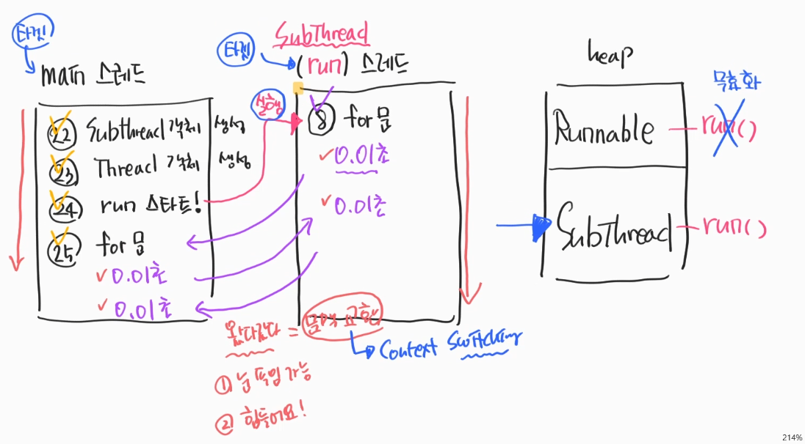

### 1. thread
#### 1.1. 눈속임 ↔ 짧은 시간 단위로 이동
- 하나의 CPU가 두 가지 이상의 일을 동시에 하는것 → muili thread
- 자바에서는 기본적으로 스레드를 하나만 가지고 있다. → main thread
- 짧은 시간 단위로 이동하면 눈속임이 가능하다.
- 문맥 파악이 힘들다.
    - context : 전후사정
    

#### 1.2. 실습
- 소스 해석
- [코드보기](https://github.com/GyeomFka/java-dare/blob/master/src/main/java/ch07/ThreadEx01.java)
   
1. main thread 내부에서 sub thread 객체 생성
2. heap공간에 SubThread객체 생성(부모가 runnable)
    2.1) 스레드의 실행조건
3. thread객체 생성 → 객체 생성 조건 → 다형성을 활용한 SubThread객체 target설정 
4. run method 실행
5. 따로 실행되는것처럼 보이지만, 짧은시간 단위로 이동한다.
     5.1) 눈속임 가능하지만 힘들다
     5.2) 문맥을 교환해서 파악이 힘들다. → context switching
  

*** 
스레드 객체를 만들어서
  → run method 공간을 만든다.
  → 타겟을 설정한다(runnable 다형성)
  → runnable 타입을 상속받은 객체의 run method가 target이 된다.
  → run을 실행시킨다.
  → context switching 실행 
***