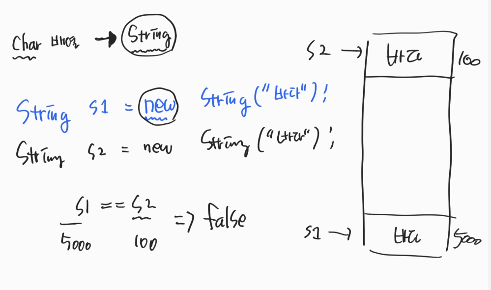
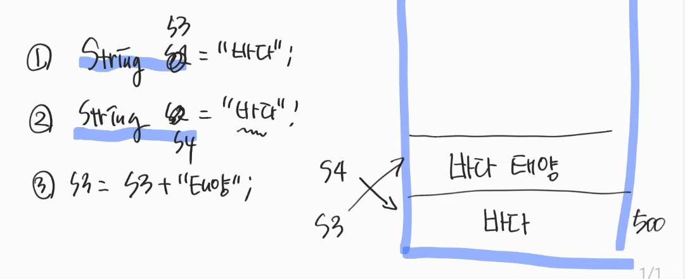
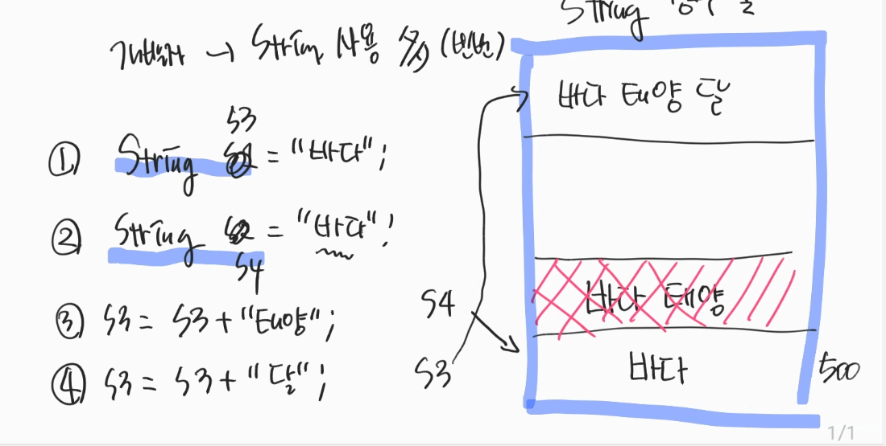

### 1. String
- int : 4Byte
- char : 2Byte
- String : 대문자 시작 → Class 표기법 → 기본 자료형이 아니다 → 값을 들고 있는게 아니고, 주소를 가리킨다.
    - 기본 : char의 배열이다.
    - String s1 = new String("문자열"); → heap영역
    - String s2 = new String("문자열"); → heap영역
      
</br>
    

- 썰 ; String사용이 빈번할 것 같다. → 계속 new 하는건 비효율적이다 → 그럼 String만 new를 하지않고 
<br> String s3 = "문자열";
<br> String s4 = "문자열";
<br> 허락해준다.
  - 이 때 s3 == s4 → true
- ***String Constant Fool*** 이라는 영역이 존재한다.


````java
public class StringEx01 {
    public static void main(String[] args) {
        String s3 = "문자열";
        String s4 = "문자열";
        System.out.println(s3 == s4); //true

        s3 = s3 + "또 다른"; //garbage의 수집대상

        s3 = s3 + "또 다른2"; //또 다른 메모리 할당
        
    }
}
````
</br>
</br>

- 장점 : 같은 문자열 → 같은 공간 공유 → 메모리 효율 좋다
- 단점 : 문자열을 변경하게 될 때마다 → 세로운 공간 할당 
    - 자주 비교할때는 StringBuilder를 사용하는게 더 효율적이다.
    

- 문자열 비교는 → equals method를 사용하는게 좋다.