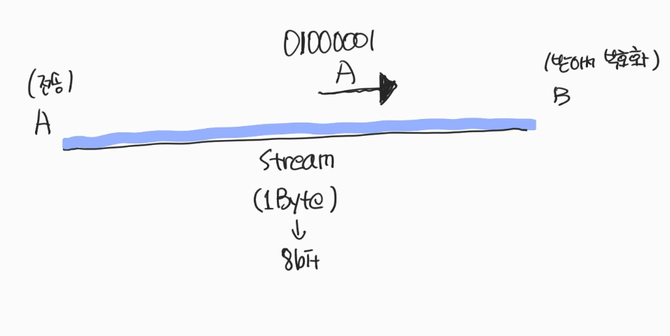
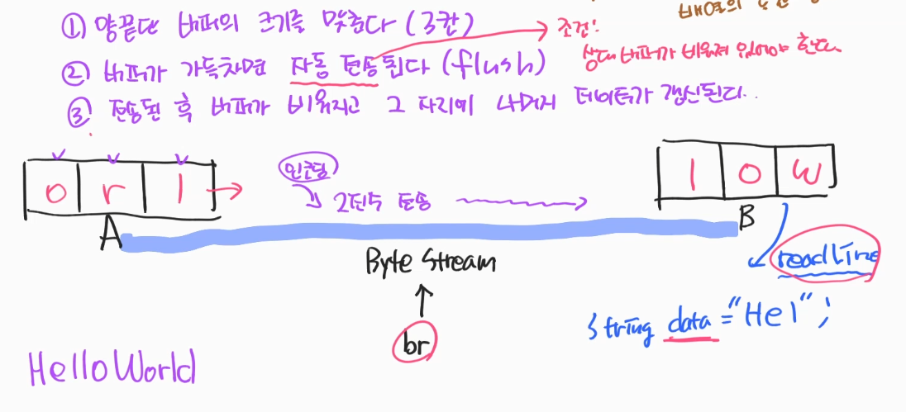

### 1. Buffer?
- 임시 저장 공간.

#### 1.1. Stream  
- 수도꼭지 비유. → ***물의 흐름(stream)*** → 프로그래밍에선 ***전류의 흐름*** → 1Byte 단위 
- 키보드로 'A'를 입력 → 컴퓨터로 65를 전송 → Input
- 모니터로 'A'를 출력 → 모니터로 65를 전송 → Output
    - 아스키 코드를 분석 후 전송 ***I/O***
  
- Stream → 1Byte : 8bit 단위로 전송되는 통로 
  - 문자열 하나씩 전송 가능
      
</br>
#### 1.2. InputStream 활용
```java
public class StreamEx01 {
    public static void main(String[] args) {
        InputStream in = System.in; // → 키보드에 연결된 stream이다.
        //keyboard → [byte단위의 stream 통로 : 주소 = in] → computer
        // input시점에 encoding을 한다
        // byte stream 에서는 *encoding*된 data가 흐르는 작업 : 컴퓨터가 알아볼 수 있도록
        // in.read() method는 *decoding* 작업 : 사람이 알아볼 수 있도록
        // int 로 들어온 것을 부호화도 가능하다.
        try {
            int data = in.read(); // → 2진수로 받은 신호를 10진수로 변환해서 읽어준다.
            System.out.println(data);
        } catch (Exception e) {
            e.printStackTrace();
        }
        //keyboard → 인코딩 전 data → 인코딩 data = 인코딩이란 → 컴퓨터가 이용할 수 있는 신호로 만드는 작업 
        // → 10진수로 전환 → in.read()에서 디코딩
    }
}
```
#### 1.3. InputStreamReader 활용
- 단점 : 가변적인 활용이 불가능
```java
public class StreamEx02 {
    public static void main(String[] args) {
        InputStream in = System.in;
        InputStreamReader ir = new InputStreamReader(in); // 65 → (char)65로 부호화 → A
        // 단점 : 가변적으로 받질 못한다. 문자열 배열 미리 설정해야함.
        try {
            char[] data = new char[3];
            //int data = ir.read();
            // ABC → input → output → ABC 
            ir.read(data);
            System.out.println(data);
        } catch (Exception e) {
            e.printStackTrace();
        }
    }
}
```

#### 1.4. BufferedReader 활용
- 숫자 → 부호화
- 문자를 가변적으로 받는다 → 배열의 공간 낭비가 없다.

##### 1.4.1. How to works?
1) 양 끝단 버퍼의 크기를 맞춘다.
2) 버퍼가 가득차면 자동전송 된다 → ***flush*** 
   <br> 2-1) flush 조건 → 상대 buffer가 비워져 있어야 한다. 
   <br> 2-2) 상대 버퍼에선 br.readLine() method를 통해 String data = "Hel"; 형식으로 들어온다.
   <br> 2-3) 해당 버퍼를 비운다 → flush 가 작동한다.
   <br> 2-4) readline() : 전송받은 데이터를 불러들이는 행위
3) 전송된 후 버퍼가 비워지고 그자리에 나머지 데이터 갱신

</br>
```java
public class StreamEx03 {
    public static void main(String[] args) {
        InputStream in = System.in;
        InputStreamReader ir = new InputStreamReader(in);
        BufferedReader br = new BufferedReader(ir);
        try {
            String data = br.readLine(); //readLine() → 전송된 데이터를 불러온다.
            System.out.println(data);
        } catch (Exception e) {
            e.printStackTrace();
        }
    }
}
```