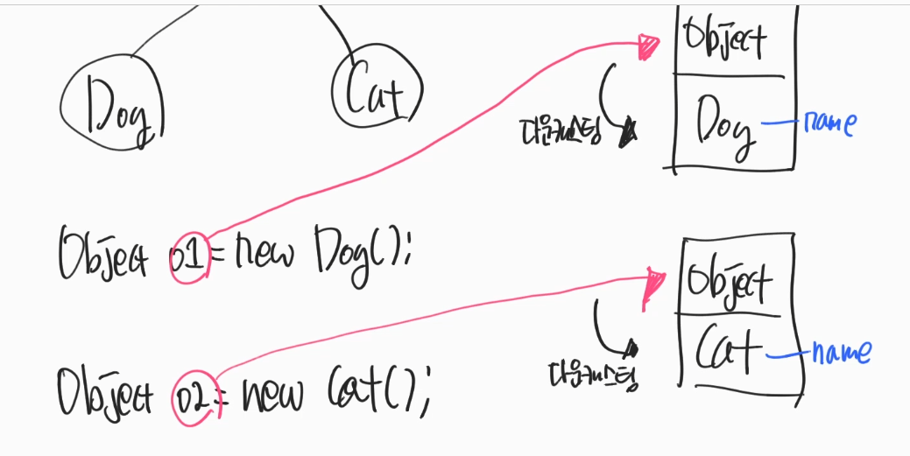

### 1.Object class
- Object → new 가능한 대상
- Object class → 모든 클래스의 부모

</br>


```java
class ObjectEx01 {
    public static void main(String[] args) {
        Object o1 = new Dog();
        Object o2 = new Cat();

        //다운 캐스팅을 해야한다.
        Dog d1 = (Dog) o1;
        Cat c1 = (Cat) o2;
    }
}
```
- 왜 사용하는가 ?
    - 배열같은 경우 같은 타입으로 넣어줘야 한다.
    - 타입을 묶어줘야 할 때.
    
- 단점
    - 다운캐스팅을 활용해야 한다.
```java
class ObjectEx01 {
    public static void main(String[] args) {
        Object[] s1 = new Object[2];
        s1[0] = new A();
        s1[1] = new B();
    }
}
```