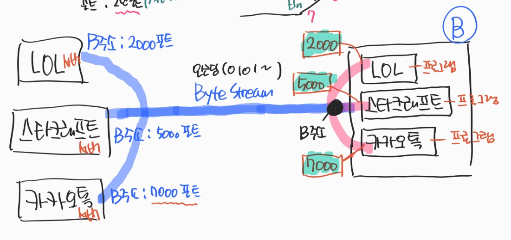
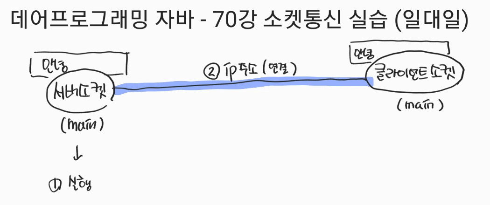
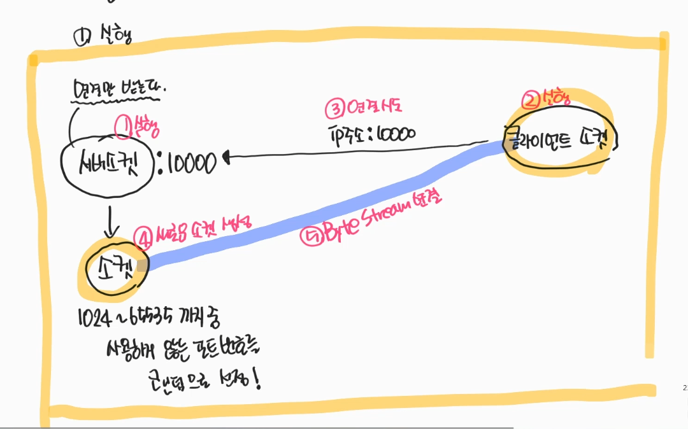

### 1.소켓통신
#### 1.1. port : 내부'주소' → 논리적 개념 
- 통신 개체들의 포트를 정해서 해당 포트로 Byte Stream을 연결해 통신한다.
- 가변길이의 data를 받기위해 각 포트엔 buffer가 달려있다.
- 포트로 인해 하나의 피시로 여러 프로그램 통신이 가능하다.
- 0 ~ 65535 → 그중 0 ~ 1023 포트는 제어 불가능
 

### 2.소켓통신 실전(1:1)
- server소켓 ↔ client소켓
- 서로의 주소를 알아야 한다 : IP주소(컴퓨터 주소)
- 각각 main method를 가지고 있다.
- 연결 후 버퍼를 생성

 

- 두개가 있는 이유
- ServerSocket → 연결만 받는다 → 소켓을 생성한다.
- Socket → 실제 client 소켓과 스트림을 연결한다. → 실제 통신 소켓
- Socket자체 → port통신 -
- serverSocket = new ServerSocket(10000);
    - 10000번의 포트를 open한다.

 

#### 2.1. IP
- IPv4 체계 : 000.000.000.000 
  - 각 자리 0~255

