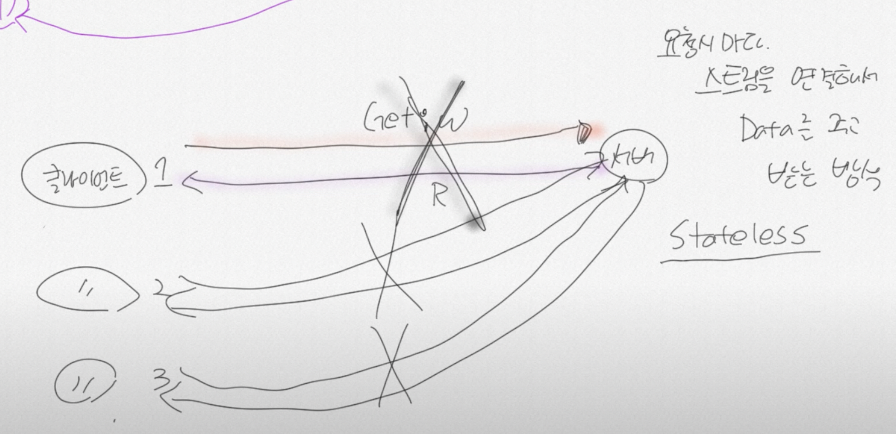

### 자바에서의 Socket통신
- 포트간의 통신

- 서버인 B입장에서 각각의 Client와 연결이 되어있는 상태면은 자원낭비가 심하다.
- Http방식은 이런 방식을 쓰지 않는다.
  - 위 방식은 채팅기능에서 많이 쓰인다. -> stateful 방식
- Http방식은 요청에 응답 후 -> 연결을 끊어버린다.
- 요청 시 마다 스트림을 연결해서 데이터를 주고 받는다.
  - stateless -> 부하가 줄어든다. -> http의 통신방식

### 인증방식
1. stateful
  - 한 번 서로의 인증 후 세션이 생성 == 데이터 응답 해 줄 준비가 되어있다.
  - 인증 -> 통신 데이터 막 주고 받는다

2. stateless 
   - 한 번의 인증 후 -> 연결이 끊긴다 -> 새로 요청할 때 인증이 보장이 안된다.
   - http방식 기본적으로 문서 전달의 목적으로 만들어졌지만 요즘은 회원가입도 하고 인증도 하고 별 짓을 다하는데 인증이 많이 필요한데
   - a와 연결 후 연결이 끊긴 후 재 연결시 어떻게 인증을 확인하지? 
   - stateless에서 인증 방법 -> Security -> 어떻게 세션을 유지하는지