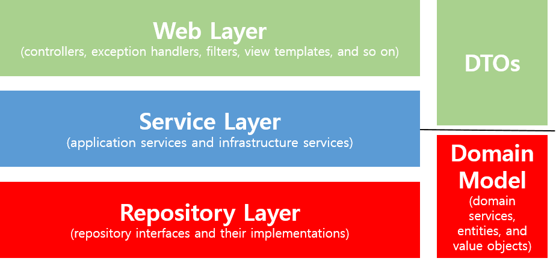

### 스프링 웹 계층

#### Web Layer - Controller
1. controller는 client `요청`을 받는다
   - 논리적인 URL(주소) 과 물리적인 URL(파일) 매핑작업
   - 처리해야 할 서비스들이 증가함에 따라, Controller라는 분기 담당 객체를 생성해 필요한 서비스를 호출하도록 한다.
   - `역할을 분담한다.`가 핵심이다.
2. 실제 서비스 로직으로의 분기
3. 로직의 반환된 결과를 client에게 `응답`을 보내준다.
    * `응답`의 종류
        - view 형태
        - object 형태
    * `Controller`의 종류
        - @Controller
        - @RestController
4. 웹 프로그래밍에서의 객체
   - HttpServletRequest 객체 : WEB → Server
   - HttpServletResponse 객체 : Server → WEB
5. 바인딩에 따른 서버 명칭
   - View + Html == WEB
   - View + Json == API
   
#### @Controller, RestController
1. @Controller 
   - @Controller + @ResponseBody → (기본적으로)JSON 반환 → MIME유형에 따라 XML 등 다른 형태로도 가능
   - @Controller → String 반환 → ViewResolver설정에 맞게 렌더링 된 template engine 소스 반환
   
2. @RestController(Spring Restful Controller)
   - RestfulAPI 서버 개발에 용이
   - 주로 Json형태로 객체 데이터 반환