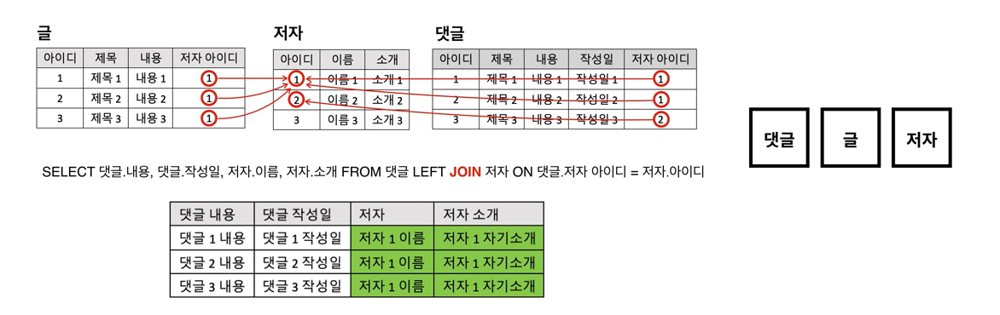
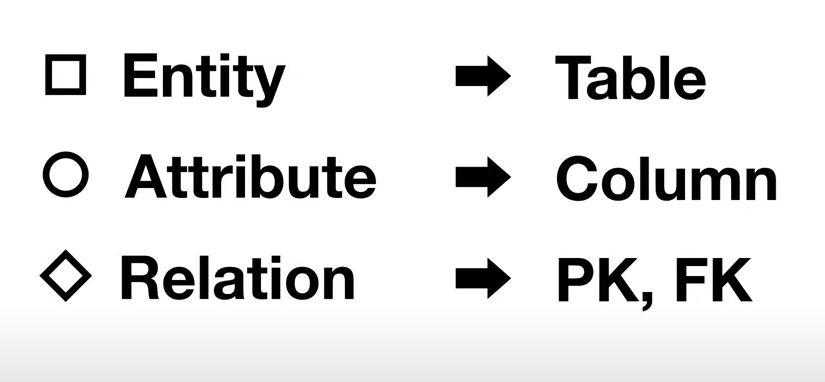
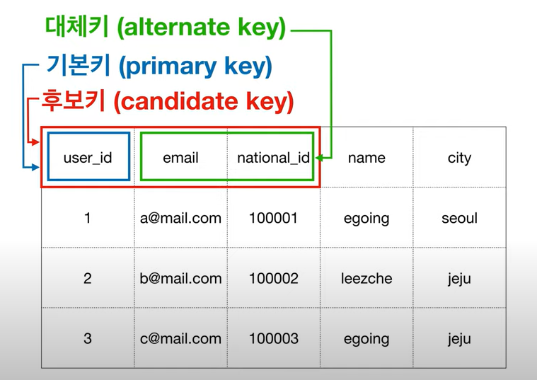
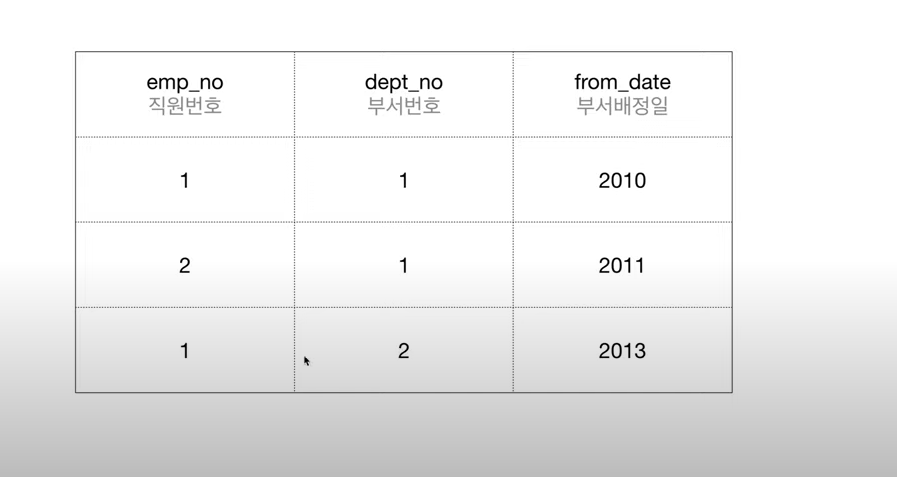
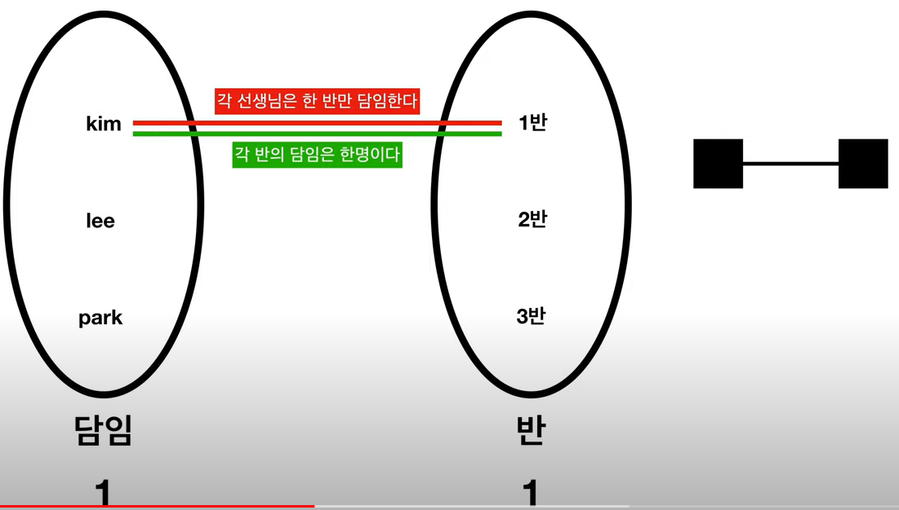
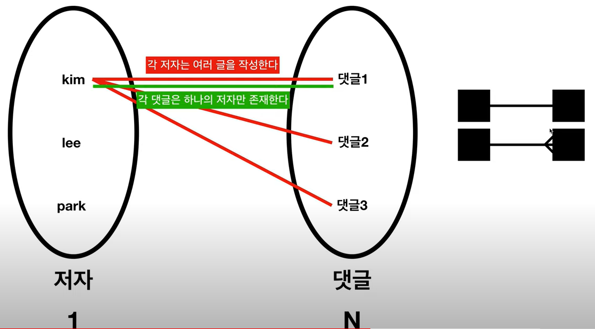
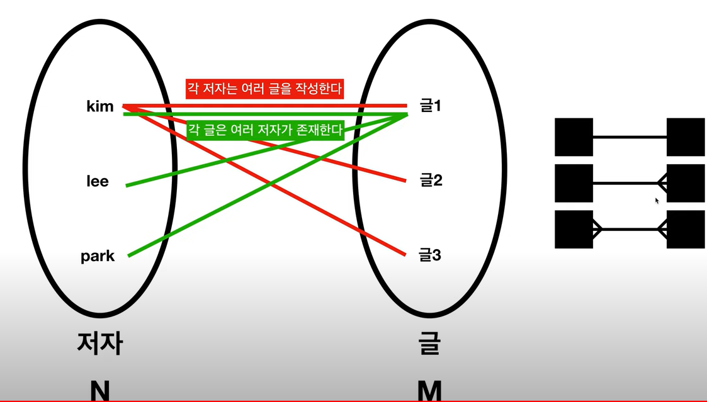
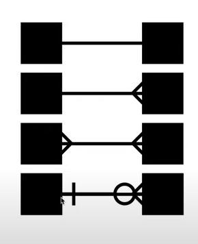

### 당부말씀
- 일 순서 != 공부 순서
- 업무와 RDB 관계의 극치

### 효용성
- 현실에서 개념을 추출하는 필터
- 개념을 기반으로 대화를 유용하게 해주는 언어
- Entity Relationship Diagram

### ERD
- 정보
- 그룹
- 관계

### 설계 근본
- 단일 테이블은 중복이 발생한다. 많이
- 주제에 따라 테이블을 쪼갠다.
- 필요할 때 순간순간 테이블을 합성한다 = JOIN

### ERD 구성요소
- Entity → Table
- Entity간의 관계
- 개념에 집중 + DB 패러다임과 거리룰 두고있다. → 실제 DB언어와 다르다

  
### Entity 정리
- 기획서와 모델링은 근접하다. <4.5 속성 정의(완강)>

### 식별자
- 원하는 대상을 정확하게 타겟한다.
- 그 대상을 제외한 누구도 같은 값을 가지면 안된다.

- 후보키 : 식별자 후보 
- 대체키 : 성능향상을 위해 secondary index를 위해 지정

- 복합키 

### Relationship

- 글 테이블, 댓글 테이블의 `저자_아이디` 의 값 = 외래의 테이블과 연결사용 키 = 외래키
- RDBMS에서의 `관계`는 Primary key와 Foreign Key가 연결됨을 통해 실제로 구현된다.

#### Cardinality
- A 와 B의 관계가 있을때
    - A에게 B는 몇개인가 ?
    - B에게 A는 몇개인가 ?
- 1:1 관계

  
- 1:N 관계  

  
- N:M 관계
  - 중간에 테이블을 하나 두어 표현한다.

#### Optionality
- 저자가 댓글을 작성 무적권해야하나?
- 저자에게 댓글은 `Optional`이다
- 댓글에게 저자는 `Mendatory`이다.
  

### Cardinality, Optionality를 모두 반영
