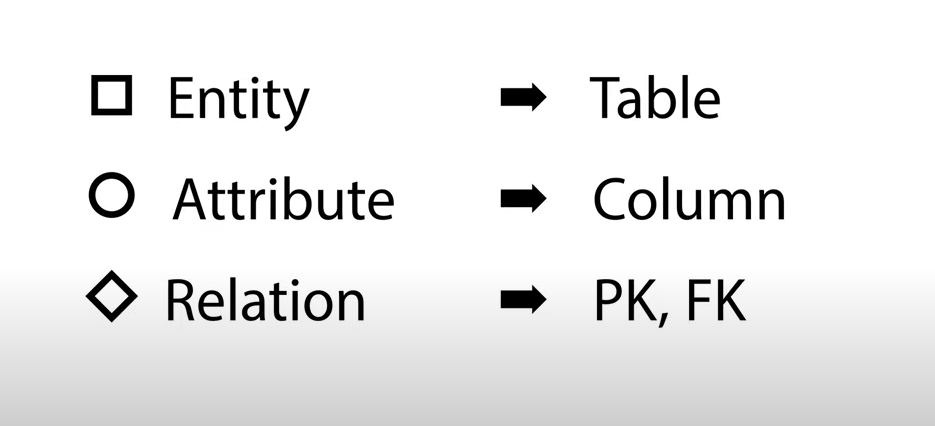
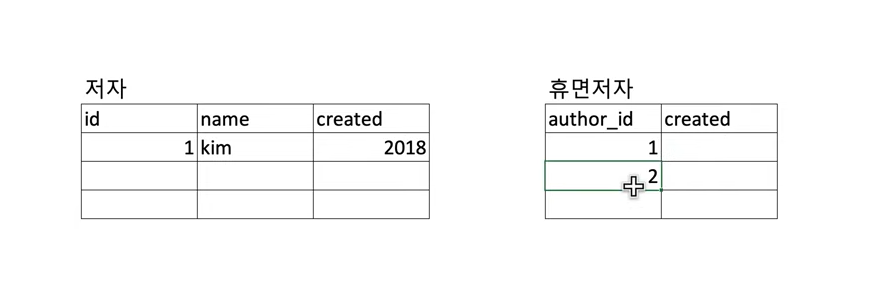
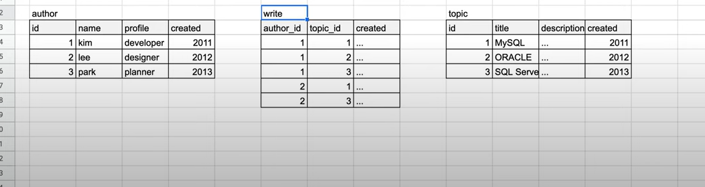

### 논리적 모델링
- 관계형 데이터베이스의 패러다임을 기반으로 개념적 모델링의 형식을 정리하는것
- 특정 DBMS제품, 성능부분은 고려를 `약하게` 한다.
- 관계형 데이터베이스 패러다임을 중점적으로

### Mapping Rule
- ERD를 통해 RDBMS에 맞는 형식으로 전환할때의 `방법론`

  
### ER Master
- ermaster.sourseforge.net
- ERD → RDBMS Model

### Relationship → PK, FK
- Cardinality 고려

### 1:1 관계처리
- FK를 어디로 넣어야 하나 햇갈릴때
  
  - 의존성 확인
      - 휴면저자는 저자의값만 추가가능하다 (논리적)
      - 저자는 휴면저자에 상관없이 추가가능하다
      - → 휴면 저자는 저자에 의존한다.
  - 자식테이블 , 의존관계를 해석 후 자식테이블에 FK생성
  - Cardinality, Optionality 고려
  
### 1:N 관계처리
- `comment`테이블의 입장에서 `author`와 `topic`과 관련이 있다.

### N:M 관계처리
- N:M 관계가 애매하다. 그럼 어캄?
- 중재자가 필요하다 → 매핑 테이블, 연결 테이블
  