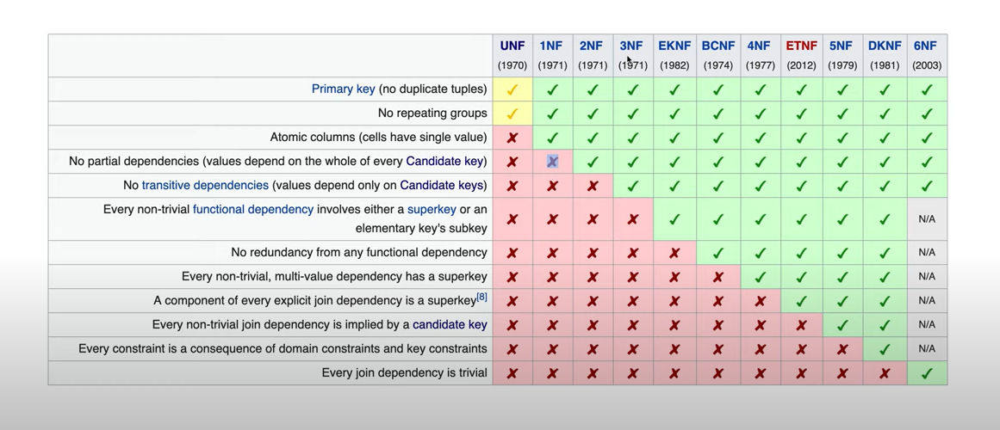
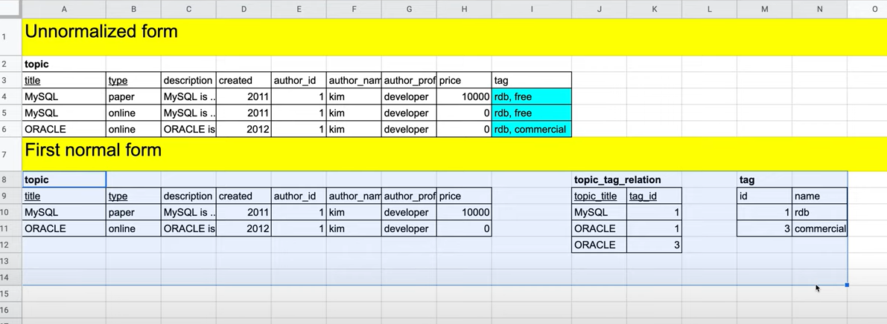
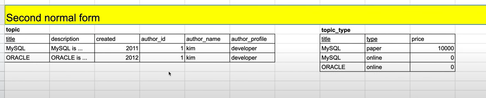
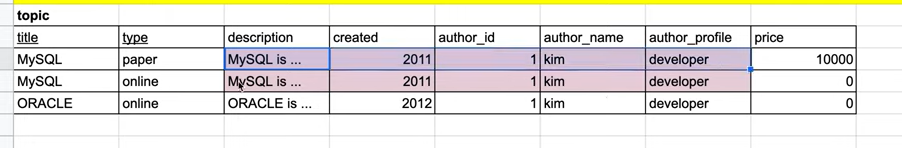
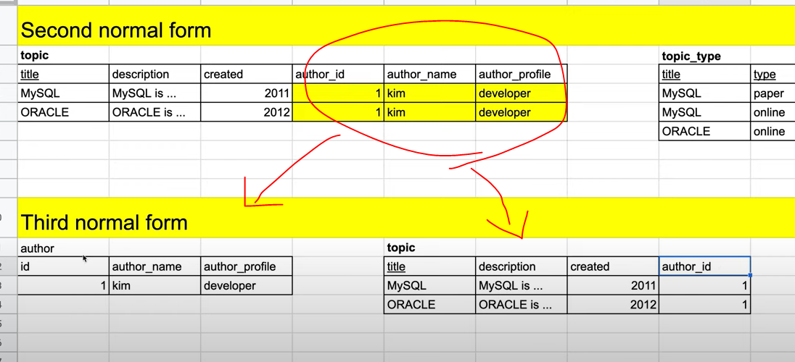

### Normalization

- 제3정규화 : 상업적인 사용
- 이 후 : 학술적인 영역

### 제1 정규형을 만드는 제1 정규화
#### First Normal Form
#### Atomic columns
- 각 행의, 각 컬럼의 값들이 `원자`적이어야 한다.

  

### 제2 정규형을 만드는 제2 정규화
#### Second Normal Form
#### No partial dependencies
- 부분 종속성이 없어야 한다.
  

- 부분 종속성이 발생한다 == 중복이 발생한다. 
- 중복된 행이 하나의 키값에 의존한다.
    - 해당되는 키값을 통해 중복되는 행을 얻어낼 수 있다.

  

### 제3 정규형을 만드는 제3 정규화
#### Third Normal Form
#### No transitive dependencies
- 이행적 종속성

- topic의 각 행은 title이라는 기본키의 종속 되어있다.
- author_id는 title에 종속되어 있긴 하다.
- author_name, author_profile 은 author_id에 의존한다
- title ← author_id ← auth_name, auth_profile 의 의존관계가 성립한다.
    - `이행적 종속성` → 중복발생의 나쁜요소

