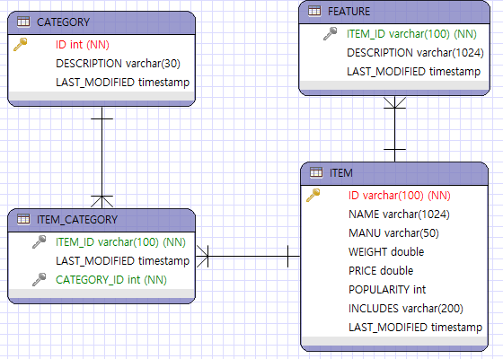

### DIH
- 원본 데이터에서 데이터를 추출해서 저장하는 방법
    - [Data Import Handler](https://forest71.tistory.com/203?category=628611)
    - [field정의](https://m.blog.naver.com/PostView.naver?isHttpsRedirect=true&blogId=webmcr&logNo=220920656568)
- ***각 core에 해당하는 solrconfig.xml에서 data-import-handler 설정을 할 수 있다.***
- datasource path(postgresql-x.x.x.jar)
    - C:\tools\solr-7.7.3\server\solr-webapp\webapp\WEB-INF\lib
    - solr-7.7.3\server\solr-webapp\webapp\WEB-INF\lib [O]
      
- RDBMS는 정규화 개념을 사용하지만, 검색엔진에서는 하나의 데이터로 묶어서 저장한다.
    - RDB에서의 1:n 구성 → 검색엔진에서 배열([]), multiValued로 저장한다.
- dataSource 태그 → 접속 정보입력
- document 태그 → 처리할 데이터를 정의
```xml
<document>
  <entity name="item" query="select * from item"
          deltaQuery="select id from item where last_modified > '${dataimporter.last_index_time}'">
    <field column="NAME" name="name" />
  </entity>
</document>
```
[출처](https://forest71.tistory.com/203?category=628611) : [SW 개발이 좋은 사람:티스토리]
- data변경감지 → delta-import
- DIH 파일에서는 managed-schema에 지정되지 않은 컬럼은 저장되지 않는다.
    - DIH 에서는 Shemaless가 적용되지 않는다.
      [DIH solr document](https://solr.apache.org/guide/8_4/uploading-structured-data-store-data-with-the-data-import-handler.html#uploading-structured-data-store-data-with-the-data-import-handler)
---
